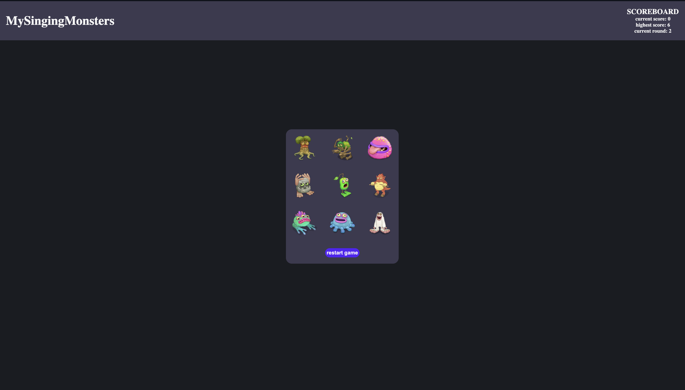

# 💭The project
This is a memory game project build as an assignement for [the odin project](https://www.theodinproject.com/lessons/node-path-react-new-memory-card), with the intention to deepen
ones understanding of the useEffect and useState React hooks. 

The objective is simple: try to click each image only once; if you do that with every shown image, you move on to the next level and now have 3 more images you have to worry about.

# 🖥️ demo
The project was deployed on Vercel, you can check it out [here](https://top-memory-game-ten.vercel.app)

# 🪼 what I learned
  1. Improved my understanding of the core principles of React, such as the way components are created, rendered, mounted, and how props effect them
  2. Learned how and when to use the useEffect and useState hook
  3. Refreshed my CSS-Grid knowledge
  4. picked up how to use scss in React without manually compiling it
